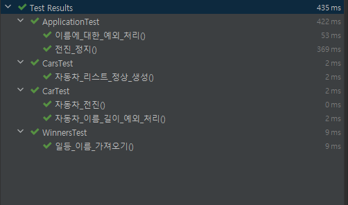
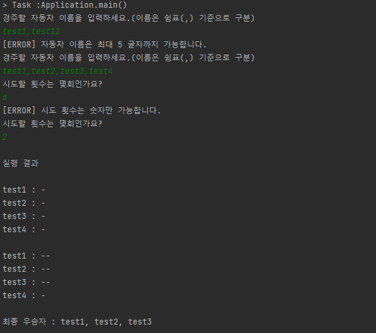

# 프리코스 2주차 자동차경주게임

## 기능 요구사항

- [x] 자동차
  - [x] 이름을 가지고 있음
    - [x] 자동차 이름은 5글자 이하만 가능
  - [x] 전달 받은 숫자가 4이상일 경우 전진, 3이하일 경우 멈춤
- [x] 자동차 리스트
  - [x] 일급 콜렉션
  - [x] 자동차 이름을 전달 받아 자동차 리스트에 등록
  - [x] 각 자동차에게 0 ~ 9 랜덤 숫자 전달
- [x] 우승자
  - [x] 일급 콜렉션
  - [x] 우승자 등록
  - [x] 우승자 리스트 가져오기
- [x] 게임
  - [x] 사용자에게 자동차 이름 리스트를 전달 받아 자동차 리스트에 등록
  - [x] 사용자에게 시도 횟수를 입력 받아 실행 결과 출력
- [x] 입/출력
  - [x] 자동차 이름 입력
  - [x] 시도 횟수 입력
  - [x] 우승자 출력
  - [x] 잘못 입력 시 IllegalArgumentException를 발생 시키고 "[ERROR] "로 시작하는 에러 메시지 출력
    - [x] 에러 출력 후 다시 입력
- [x] 공통
  - [x] 예외 처리 명확하게

## 프로젝트 구조

- constants: 공통으로 사용하는 상수 package
- game: 게임이 동작하는 비즈니스 로직이 담긴 package
- io: 사용자의 입력과 화면에 출력을 담당하는 package
- model: 모델 package
- strategy: Move 전략 package

## 테스트 결과

## 실행 결과
